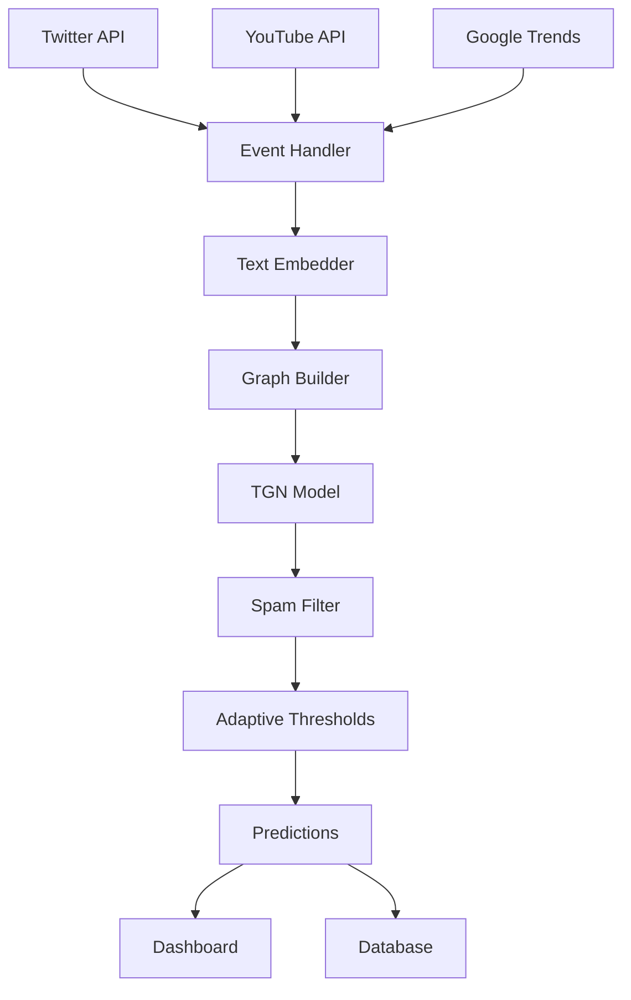

# 📈 Trend Prediction Model

A real-time temporal graph neural network (TGN) system for predicting trending topics across multiple social media platforms. The system collects data from Twitter/X, YouTube, and Google Trends, processes it through advanced ML pipelines, and provides real-time predictions with an interactive monitoring dashboard.

## 🏗️ Architecture Overview

The trend prediction pipeline consists of several interconnected components:

```
Data Sources → Data Pipeline → Model Inference → Dashboard
     ↓              ↓              ↓           ↓
[Twitter/X]   [Text Embedding]  [TGN Graph]  [Streamlit UI]
[YouTube]  →  [Preprocessing] → [Spam Filter] → [Monitoring]
[G.Trends]    [Graph Builder]   [Thresholds]   [Visualizations]
```

### Pipeline Components

1. **Data Collection Layer**: Multi-source streaming data collectors
2. **Processing Layer**: Real-time text embedding and graph construction
3. **Model Layer**: Temporal Graph Networks with adaptive thresholds
4. **Service Layer**: Runtime orchestration and event handling
5. **Interface Layer**: Interactive dashboard for monitoring and control

---

## 🚀 Quick Start for End Users

### Prerequisites

- Python 3.10 or higher
- 4GB+ RAM recommended
- Optional: NVIDIA GPU with CUDA 11.8 for enhanced performance

### 1. Installation

**Step 1: Clone the repository**
```bash
git clone https://github.com/mandywwl/trend-prediction.git
cd trend-prediction
```

**Step 2: Install dependencies**

For CPU-only setup (recommended for most users):
```bash
pip install -r requirements-cpu.txt
```

For GPU acceleration (NVIDIA users with CUDA 11.8):
```bash
pip install -r requirements-cuda118.txt
```

**Step 3: Install additional dependencies**
```bash
pip install streamlit matplotlib tweepy transformers google-api-python-client pytrends
```

**Step 4: Set up Python path**
```bash
export PYTHONPATH="${PWD}/src:${PYTHONPATH}"
```

**Step 5: Configure API keys**
```bash
cp .env.example .env
# Edit .env file with your API keys:
# - TWITTER_BEARER_TOKEN (from https://developer.twitter.com/)
# - YOUTUBE_API_KEY (from https://console.developers.google.com/)
```

### 2. Running the System

**Start the main prediction service:**
```bash
cd src
python -m service.main
```

**Launch the monitoring dashboard (in a new terminal):**
```bash
# Set Python path to include src directory
export PYTHONPATH="${PWD}/src:${PYTHONPATH}"
streamlit run dashboard/app.py
```

Alternative for one-time run:
```bash
PYTHONPATH=./src streamlit run dashboard/app.py
```

**Access the dashboard:**
Open your browser to `http://localhost:8501`

### 3. Using the Dashboard

The dashboard provides four main panels:

- **📊 Now (Top-K Live)**: Real-time trending predictions
- **⏱️ Latency & SLOs**: System performance monitoring  
- **🛡️ Robustness**: Model reliability metrics
- **📋 About**: System information and configuration

---

## 🔧 Developer Guide

### Development Setup

**1. Install development dependencies:**
```bash
pip install -r requirements-cpu.txt
pip install pytest pytest-cov black flake8 mypy
```

**2. Set up Python path:**
```bash
# Add to your shell profile (~/.bashrc, ~/.zshrc, etc.)
export PYTHONPATH="${PWD}/src:${PYTHONPATH}"

# Or for current session only:
export PYTHONPATH="$(pwd)/src:${PYTHONPATH}"
```

**3. Run tests:**
```bash
cd src && python -m pytest ../tests/
```

**4. Code formatting and linting:**
```bash
black src/ tests/
flake8 src/ tests/
mypy src/
```

### Project Structure

```
trend-prediction/
├── src/                          # Main application code
│   ├── config/                   # Configuration management
│   │   ├── environments/         # Environment-specific configs
│   │   └── schemas.py           # Data schemas and validation
│   ├── data_pipeline/           # Data collection and processing
│   │   ├── collectors/          # Twitter, YouTube, Google Trends APIs
│   │   ├── processors/          # Text embedding, preprocessing
│   │   ├── storage/             # Graph building and persistence
│   │   └── transformers/        # Data transformation utilities
│   ├── model/                   # Machine learning components
│   │   ├── core/                # Core TGN model implementation
│   │   ├── training/            # Training scripts and optimization
│   │   ├── inference/           # Real-time inference pipeline
│   │   ├── evaluation/          # Model evaluation metrics
│   │   └── baselines/           # Baseline model implementations
│   ├── service/                 # Service infrastructure
│   │   ├── main.py             # Main service entry point
│   │   ├── runtime_glue.py     # Runtime orchestration
│   │   ├── training_scheduler.py # Periodic retraining
│   │   └── api/                # REST API endpoints
│   └── utils/                   # Shared utilities
├── dashboard/                   # Streamlit monitoring dashboard
│   ├── app.py                  # Main dashboard application
│   ├── components/             # Reusable UI components
│   └── layouts/                # Dashboard layouts
├── tests/                      # Test suite
│   ├── unit/                   # Unit tests
│   └── integration/            # Integration tests
└── datasets/                   # Data storage directory
```

### Key Components Deep Dive

#### Data Pipeline (`src/data_pipeline/`)

**Collectors**: Real-time data ingestion from multiple sources
- `twitter_collector.py`: Twitter/X streaming API integration
- `youtube_collector.py`: YouTube Data API for trending videos
- `google_trends_collector.py`: Google Trends API for search patterns

**Processors**: Transform raw data into model-ready features
- `text_rt_distilbert.py`: Real-time text embedding using DistilBERT
- `preprocessing.py`: Graph construction and TGN data preparation

**Storage**: Persistent data management
- `builder.py`: Dynamic graph construction and updates
- Event logging to SQLite database and JSONL files

#### Model Layer (`src/model/`)

**Core**: Temporal Graph Network implementation
- TGN-based architecture for temporal pattern learning
- Dynamic node and edge feature updates
- Memory-efficient streaming processing

**Training**: Model optimization and hyperparameter tuning
- `train.py`: Main training script with Huber loss
- `tune.py`: Optuna-based hyperparameter optimization
- `retrain.py`: Periodic model retraining on new data

**Inference**: Real-time prediction pipeline
- `spam_filter.py`: Content quality filtering
- `adaptive_thresholds.py`: Dynamic sensitivity control
- TGN-based trend prediction with confidence scores

#### Service Infrastructure (`src/service/`)

**Runtime Management**:
- `main.py`: Unified service orchestration
- `runtime_glue.py`: Event handling and prediction coordination
- `training_scheduler.py`: Automated model retraining

**Architecture Pattern**: Event-driven processing with:
- Asynchronous data collection
- Real-time feature extraction
- Graph-based temporal modeling
- Adaptive threshold management

### Development Workflow

**1. Adding New Data Sources:**
```python
# Extend base collector class
from data_pipeline.collectors.base import BaseCollector

class CustomCollector(BaseCollector):
    def collect_data(self):
        # Implement data collection logic
        pass
```

**2. Model Development:**
```bash
# Train new model
python -m model.training.train --config config.yaml

# Hyperparameter tuning
python -m model.training.tune --trials 100

# Evaluate model
python -m model.evaluation.evaluate --model-path checkpoints/
```

**3. Testing:**
```bash
# Run specific test suites
python -m pytest tests/unit/test_*.py -v
python -m pytest tests/integration/ -v

# Test with coverage
python -m pytest --cov=src tests/
```

### Configuration Management

The system uses environment-based configuration:

- `development.py`: Development settings (debug mode, smaller datasets)
- `production.py`: Production settings (optimized performance)
- Environment variables for API keys and sensitive data

**Example configuration:**
```python
# src/config/environments/development.py
DEBUG = True
LOG_LEVEL = "DEBUG"
MAX_NODES = 1000  # Smaller graph for development
EMBED_BUDGET_MS = 100  # Processing time budget
```

### Performance Monitoring

The system includes comprehensive monitoring:

- **Latency Tracking**: Request processing times and SLA compliance
- **Model Drift**: Detection of prediction quality degradation
- **Resource Usage**: Memory and CPU utilization monitoring
- **Data Quality**: Input validation and anomaly detection

### API Keys and External Services

Required API credentials:

1. **Twitter Bearer Token**: For real-time tweet streaming
   - Obtain from: https://developer.twitter.com/en/portal/dashboard
   - Permissions: Read-only access to tweets

2. **YouTube Data API Key**: For trending video data
   - Obtain from: https://console.developers.google.com/
   - Enable: YouTube Data API v3

**Security Note**: Never commit API keys to version control. Use environment variables or the `.env` file.

### Troubleshooting

**Common Issues:**

1. **Import Errors**: Ensure `src/` is in Python path
   ```bash
   export PYTHONPATH="${PWD}/src:${PYTHONPATH}"
   ```

2. **CUDA Issues**: For GPU users, verify CUDA version compatibility
   ```bash
   python -c "import torch; print(torch.cuda.is_available())"
   ```

3. **Memory Issues**: Reduce batch sizes or model dimensions in config
   ```python
   MAX_NODES = 500  # Reduce for lower memory usage
   ```

4. **API Rate Limits**: Check API quotas and implement backoff strategies
   - Twitter: 300 requests per 15-minute window
   - YouTube: 10,000 quota units per day

### Contributing

1. Fork the repository
2. Create a feature branch: `git checkout -b feature-name`
3. Make changes with appropriate tests
4. Run the full test suite: `python -m pytest`
5. Submit a pull request with clear description

---

## 📊 Pipeline Data Flow

### High-Level Architecture



### Detailed Processing Flow

1. **Data Ingestion**: Multiple collectors stream data continuously
2. **Event Processing**: Raw data normalized into structured events
3. **Feature Extraction**: DistilBERT embeddings for textual content
4. **Graph Construction**: Dynamic temporal graph updates
5. **Model Inference**: TGN processes graph for trend predictions
6. **Quality Control**: Spam filtering and confidence scoring
7. **Adaptation**: Threshold adjustment based on performance metrics
8. **Output**: Real-time predictions served to dashboard and APIs

### Data Persistence

- **Events Database**: SQLite for structured event storage
- **Graph Checkpoints**: NPZ format for TGN state persistence
- **Model Weights**: PyTorch checkpoints for trained models
- **Logs**: Structured logging for debugging and monitoring

---

## 🔗 Additional Resources

- **Documentation**: In-code documentation with detailed docstrings
- **Examples**: Sample configurations in `src/config/environments/`
- **Tests**: Comprehensive test suite in `tests/` directory
- **Dashboard**: Interactive monitoring at `http://localhost:8501`

For support or questions, please refer to the issue tracker or review the comprehensive test suite for usage examples.